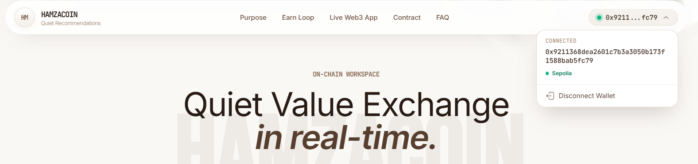
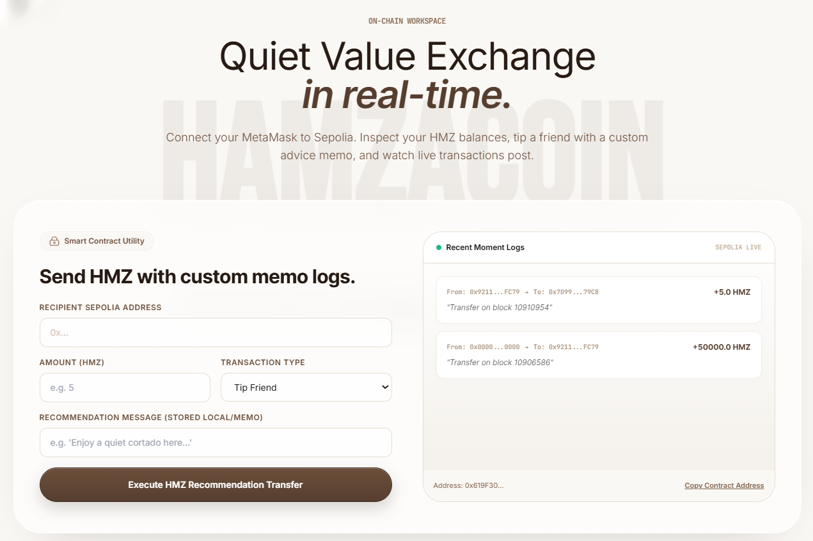
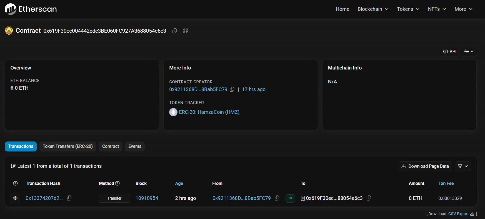

# HamzaCoin Web3 dApp

> The Quiet Recommendation Token — a React + TypeScript + Web3 portal for HamzaCoin (HMZ), deployed on Sepolia.


A browser-based dApp that connects MetaMask to the [HamzaCoin ERC20 contract](https://github.com/tahabakri/hamzacoin-contract) on Sepolia, reads your HMZ balance, lets you send HMZ to other addresses with a custom memo, and surfaces your real on-chain transaction history.

**🔗 Live demo:** _coming soon (Vercel)_
**📜 Smart contract repo:** [github.com/tahabakri/hamzacoin-contract](https://github.com/tahabakri/hamzacoin-contract)

---

## Screenshots

> Drop your PNGs into [`docs/screenshots/`](docs/screenshots/) using the filenames below and they'll render automatically.

### Hero — Fluid background + token overview card


### Wallet connected — Header pill with address + Disconnect popover



### Send form — HMZ transfer with custom memo



### Transaction history — Live on-chain Transfer events


### Etherscan — Public verification of every transfer



<details>
<summary>Expected folder structure</summary>

```text
docs/
└── screenshots/
    ├── hero.png
    ├── wallet-connected.png
    ├── send-form.png
    ├── transaction-history.png
    └── etherscan.png
```

</details>

---

## About

This is the frontend half of the HamzaCoin project. It's a single-page React app that talks directly to a deployed ERC20 contract on the Sepolia public testnet — no backend, no database, no server. Your wallet signs everything, and the blockchain stores the truth.

What it does:

- **Connects MetaMask** to the Sepolia network (auto-switches if you're on the wrong chain)
- **Reads your HMZ balance** live from the smart contract
- **Sends HMZ transfers** with a custom memo tagged as `Tip Friend`, `Cafe Spot`, or `Book Rec`
- **Loads real on-chain transaction history** for your wallet by querying past `Transfer` events
- **Falls back gracefully** when MetaMask isn't installed, you're on the wrong network, or a transaction fails

The visual layer is a Three.js fluid simulation behind everything that ripples on cursor movement — built from scratch with a wave-equation shader. The hero section, capabilities cards, FAQ, and other sections sit above it as glassy overlays.

---

## Smart Contract

This dApp talks to a single deployed ERC20 contract on Sepolia.

| Property | Value |
| --- | --- |
| **Address** | `0x619F30ec004442cdc3BE060FC927A3688054e6c3` |
| **Network** | Sepolia Testnet (chain ID `11155111` / `0xaa36a7`) |
| **Symbol** | HMZ |
| **Decimals** | 18 |
| **Total supply** | 50,000 HMZ (fixed) |
| **Etherscan** | [View on Sepolia Etherscan](https://sepolia.etherscan.io/address/0x619F30ec004442cdc3BE060FC927A3688054e6c3) |
| **Source code** | [github.com/tahabakri/hamzacoin-contract](https://github.com/tahabakri/hamzacoin-contract) |

The contract is a standard OpenZeppelin ERC20 — nothing custom on-chain. All the "recommendation" semantics (memos, transaction types) live in the frontend.

---

## Features

- ✅ MetaMask wallet integration with full connect / disconnect lifecycle
- ✅ Auto-switch to Sepolia network (handles the `wallet_addEthereumChain` 4902 fallback)
- ✅ Live HMZ balance display with loading + error states
- ✅ Send HMZ with custom memos and a typed dropdown (`Tip Friend` / `Cafe Spot` / `Book Rec`)
- ✅ Real-time on-chain transaction history via `contract.queryFilter(Transfer)`
- ✅ Network mismatch banner with one-click "Switch to Sepolia"
- ✅ Disconnect wallet popover with full address display
- ✅ Form validation (address checksum, positive amounts) before any RPC call
- ✅ Mobile responsive (Tailwind breakpoints throughout)
- ✅ Honors `prefers-reduced-motion` for accessibility
- ✅ Etherscan tx links surfaced on success

---

## Tech Stack

| Layer | Tool |
| --- | --- |
| Framework | React 18 |
| Build tool | Vite 5 |
| Language | TypeScript 5.5 (strict mode) |
| Styling | TailwindCSS 3.4 |
| Web3 | ethers.js v6 |
| Icons | `@iconify/react` (Solar Linear set) |
| WebGL background | Three.js (wave-equation fluid shader) |
| Fonts | Inter, JetBrains Mono, Bebas Neue (Google Fonts) |

No Redux, no React Query, no router — single-page anchor-scrolled layout. State lives in two custom hooks and gets passed down.

---

## Project Structure

```text
hamzacoin-react/
├── index.html
├── package.json
├── tsconfig.json
├── vite.config.ts
├── tailwind.config.js
├── postcss.config.js
└── src/
    ├── main.tsx
    ├── App.tsx                  # composes the hooks + sections
    ├── index.css                # Tailwind directives + custom keyframes
    ├── types/
    │   └── ethereum.d.ts        # window.ethereum typing
    ├── utils/
    │   ├── constants.ts         # CONTRACT_ADDRESS, HMZ_ABI, SEPOLIA_CHAIN_ID
    │   ├── format.ts            # formatAddress, formatBalance
    │   └── network.ts           # ensureSepoliaNetwork (switch + add fallback)
    ├── hooks/
    │   ├── useWallet.ts         # account, chain, connect, disconnect, error
    │   └── useHmzContract.ts    # balance, sendHmz, transfer history
    └── components/
        ├── FluidBackground.tsx  # Three.js wave-equation background
        ├── Header.tsx           # nav + wallet pill with disconnect popover
        ├── StatusBanner.tsx     # connection error + wrong-network warning
        ├── Hero.tsx
        ├── About.tsx
        ├── Capabilities.tsx
        ├── DemoSection.tsx
        ├── SendForm.tsx         # HMZ transfer form
        ├── Stats.tsx            # live transfer feed
        ├── Technical.tsx
        ├── Economy.tsx
        ├── FAQ.tsx
        ├── Creator.tsx
        ├── FinalCTA.tsx
        └── Footer.tsx
```

---

## Prerequisites

- **Node.js 18 or newer** ([download](https://nodejs.org))
- **MetaMask** installed in your browser ([metamask.io](https://metamask.io))
- A few **SepoliaETH** for gas — grab some free from [faucet.alchemy.com](https://www.alchemy.com/faucets/ethereum-sepolia)

Check Node:

```powershell
node --version
npm --version
```

---

## Local Development

From this folder:

```powershell
npm install
npm run dev
```

The dev server starts at **http://localhost:5173**. Vite gives you full hot-module reload — edit a component and the page updates without a refresh.

You'll see the fluid background ripple on cursor movement, with the marketing sections and the Web3 send form scrollable below.

To actually send a transaction, you need:
1. MetaMask connected
2. The wallet on Sepolia (the app prompts to switch automatically)
3. Some SepoliaETH for gas (free from the faucet above)

---

## Build for Production

```powershell
npm run build
npm run preview
```

`npm run build` runs `tsc` (full type-check) and then a Vite production build into `dist/`. `npm run preview` serves the static build on **http://localhost:4173** so you can sanity-check it before deploying.

Deploy `dist/` to any static host — Vercel, Netlify, Cloudflare Pages, GitHub Pages, S3. There's no server to configure.

---

## How to Use

### 1. Connect your wallet

Click **Connect Wallet** in the top-right. MetaMask will prompt you. If you're on the wrong network, the app will ask MetaMask to switch you to Sepolia automatically.

After connecting, the header pill shows your truncated address. Click it for a popover with the full address and a **Disconnect** option.

### 2. Add HMZ to MetaMask (optional)

This lets MetaMask show your HMZ balance natively. In MetaMask:

**Import Token** → paste contract address → symbol `HMZ`, decimals `18` → **Add Custom Token**.

The app shows the balance regardless — this just makes it visible inside the MetaMask UI too.

### 3. Send an HMZ transfer

Scroll to the **Live Web3 App** section.

| Field | What goes here |
| --- | --- |
| Recipient | Any valid Sepolia address (`0x…`) |
| Amount | Any positive number, e.g. `1.5` |
| Type | `Tip Friend` / `Cafe Spot` / `Book Rec` (memo prefix) |
| Memo | Free-text recommendation, stored locally in the feed |

Click **Execute HMZ Recommendation Transfer** → MetaMask pops up → confirm → wait ~15 seconds for Sepolia to mine the block. The success banner shows the transaction hash with an Etherscan link, and a new row appears at the top of the **Recent Moment Logs** feed.

### 4. View the transaction on Etherscan

Click the **View on Etherscan** link in the success banner, or open the contract page and scroll to your address:

[sepolia.etherscan.io/address/0x619F30ec004442cdc3BE060FC927A3688054e6c3](https://sepolia.etherscan.io/address/0x619F30ec004442cdc3BE060FC927A3688054e6c3)

Every transfer is publicly verifiable. That's the whole point of a blockchain — nothing is hidden.

---

## Architecture

### Custom React hooks

All Web3 state lives in two hooks. Components are dumb and just render what the hooks give them.

**`useWallet`** ([src/hooks/useWallet.ts](src/hooks/useWallet.ts)) owns:
- `account`, `chainId`, `provider`, `isConnecting`, `isCorrectNetwork`, `error`
- `connect()`, `disconnect()`, `ensureSepolia()`, `clearError()`
- Registers `accountsChanged` + `chainChanged` listeners on mount, cleans them up on unmount

**`useHmzContract`** ([src/hooks/useHmzContract.ts](src/hooks/useHmzContract.ts)) takes the provider + account and owns:
- `balance`, `balanceError`, `isLoadingBalance`
- `txStatus`, `isTxPending`
- `recentTransfers` (seeded mock + real on-chain events + locally appended new sends)
- `sendHmz(recipient, amount, memo, txType): Promise<boolean>`
- Caches `decimals()` in a `useRef` to avoid round-trips on every send

### Separation of concerns

```text
window.ethereum  ──►  utils/network.ts   ──►  hooks/useWallet.ts   ──►  components/*
                      utils/constants.ts ──►  hooks/useHmzContract ──►
                      utils/format.ts    ──►
```

Components import from hooks, hooks import from utils. Utils never import from components or hooks. Easy to reason about and easy to test.

### Type-safe contract interactions

The HMZ ABI is `as const`-asserted in [src/utils/constants.ts](src/utils/constants.ts). ethers v6 infers the function signatures from the ABI, so calls like `contract.transfer(recipient, parsedAmount)` get checked at compile time. Return types from `balanceOf()` come back as `bigint`, not `BigNumber` (v5 → v6 changed this).

The `window.ethereum` global is typed in [src/types/ethereum.d.ts](src/types/ethereum.d.ts) so any code that touches it gets autocompletion + null-checks for free.

---

## Concept

HamzaCoin is "The Quiet Recommendation Token" — built for people who prefer beautiful moments, deep cafes, books, and music over chaotic feeds and algorithm-driven likes. The site frames it as a protocol for **deliberate connection**: instead of likes and shares, you send a small amount of HMZ along with a memo that says "go to this cafe" or "read this book."

That framing is the storytelling layer. The honest framing underneath:

> This is a learning project. It demonstrates real Web3 patterns — ERC20 contracts, MetaMask integration, on-chain event listening, transaction signing — in a way that's interesting enough to actually finish and ship. Everything on-chain is real on Sepolia, but Sepolia is a free public testnet, not real money.

If you're learning Web3, this codebase is a working reference for "what does a typed React + ethers v6 dApp look like in 2026" without 50 layers of abstraction.

---

## What I Learned

Building this end-to-end (contract + dApp) taught me:

- **ERC20 standard** — what `transfer`, `balanceOf`, `approve`, `transferFrom` actually do, what `decimals` means, why fixed supply matters
- **Smart contract deployment** — Hardhat compile → local node → Sepolia testnet → Etherscan verification
- **MetaMask integration** — `eth_requestAccounts`, the difference between provider and signer, the 4902 chain-not-added pattern
- **On-chain event listening** — `contract.queryFilter(contract.filters.Transfer(from, to))` to load real history without a backend
- **ethers v6 changes** — `BigNumber` is gone, everything is `bigint`; `Web3Provider` became `BrowserProvider`; `utils` got flattened to top-level imports
- **React + Web3 patterns** — putting Web3 state in custom hooks instead of context, cleanup of event listeners, race conditions between awaits and React's batched state updates
- **TypeScript strictness with external APIs** — typing `window.ethereum`, narrowing thrown errors, `as const` on ABI arrays so ethers can infer signatures
- **WebGL shaders** — wave-equation fluid simulation with ping-pong render targets, mouse-impulse forces, vertex/fragment shader basics

---

## Try this yourself

- **Fork it** and point the `CONTRACT_ADDRESS` in [src/utils/constants.ts](src/utils/constants.ts) at your own ERC20 deployment
- **Add a token approval flow** — call `approve()` so a separate contract can spend HMZ on your behalf
- **Listen to live events** — replace the current `queryFilter` with `contract.on("Transfer", handler)` for real-time updates
- **Store memos on-chain** — extend the contract with a `transferWithMemo()` function and emit a custom event
- **Add unit tests** — Vitest + React Testing Library + a mock provider

---

## License

[MIT](LICENSE) — do whatever you want with this. If you ship something cool with it, I'd love to see it.

---

**Built by [Taha Bakri](https://github.com/tahabakri).** Companion repo to [hamzacoin-contract](https://github.com/tahabakri/hamzacoin-contract).
